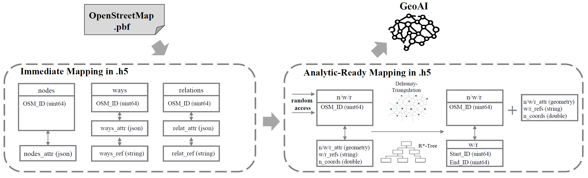

# AtlasHDF
AtlasHDF: An Efficient Big Data Framework for GeoAI

Abstract
---------------------

In this paper, we introduce an efficient big data framework based on the modern HDF5 technology, called AtlasHDF, in which we designed lossless data mappings (immediate mapping and analysis-ready mapping) from OpenStreetMap (OSM) vector data into a single HDF5 data container to facilitate fast and flexible GeoAI applications learnt from OSM data. Since the HDF5 is included as a default dependency in most GeoAI and high performance computing (HPC) environments, the proposed AtlasHDF provides a cross-platformm and single-techonology solution of handling heterogeneous big geodata for GeoAI.

Figure: The overview of AtlasHDF, which consists of two main modules: (1) Immediate mapping of OSM data representation; (2) Analysis-ready Mapping for GeoAI

Citation
---------------------

Martin Werner and Hao Li. 2022. AtlasHDF: An Efficient Big Data Framework for GeoAI. In The 10th ACM SIGSPATIAL International Workshop on Analytics for Big Geospatial Data (BigSpatial ’22) (BigSpatial ’22), November 1, 2022, Seattle, WA, USA. ACM, New York, NY, USA, 7 pages. https://doi.org/10.1145/3557917.3567615

Contact
---------------------

Martin Werner: martin.werner@tum.de 
Technische Universität München, Professur für Big Geospatial Data Management, Lise-Meitner-Str. 9, 85521 Ottobrunn
