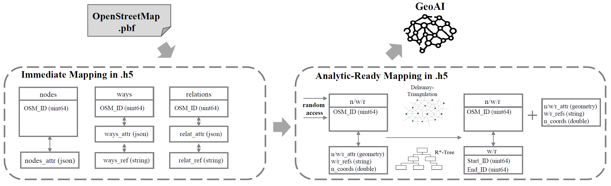

# AtlasHDF

AtlasHDF: An Efficient Big Data Framework for GeoAI

## Abstract

In this paper, we introduce an efficient big data framework based on the modern HDF5 technology, called AtlasHDF, in which we designed lossless data mappings (immediate mapping and analysis-ready mapping) from OpenStreetMap (OSM) vector data into a single HDF5 data container to facilitate fast and flexible GeoAI applications learnt from OSM data. Since the HDF5 is included as a default dependency in most GeoAI and high performance computing (HPC) environments, the proposed AtlasHDF provides a cross-platformm and single-techonology solution of handling heterogeneous big geodata for GeoAI.

*Figure 1: The overview of AtlasHDF, which consists of two main modules: (1) Immediate mapping of OSM data representation; (2) Analysis-ready Mapping for GeoAI*

## Introduction
This document fixes the AtlasHDF container format for the HDF4Water project.
## Genesis of the AtlasHDF Implementation Scheme for the HDF4Water Demonstrator

This section describes concisely all decisions that we took towards adapting the flexible AtlasHDF data storage framework to the requirements of a sustainable, simple, (almost) dependency-free data representation for GeoAI across multiple modalities. As this is an incubator project, many decisions are not sufficiently benchmarked and checked and a community process is envisioned to go through these open questions where we just took a single path for this incubator project. We present the genesis of the framework as a sequence of decisions and give hints on the background of our choices. These decisions can be taken as a blueprint for a community or standardization process after completing this demonstration.

### Decision 1: File Format
Choosing the file format is tricky as many communities are currently proposing many options. Interesting dicussions can be found in the machine learning community. We require (1) fast access (memory mapping), (2)  built-in support of compression, (3) multilingual strings (UTF-8), (4) platform-independence and (5) command line tool support and (6) hiearchical structuring into groups or folders, (7) single file for simple Internet Downloads and DOI assignments. Based on this, still many choices are available, but we choose HDF5 for the reason that it is the only suitable file format that is already a dependency of tensorflow and pytorch and, thus, does not introduce any additional overhead. Zarr is a natural alternative, yet less mature. 

Based on this incomplete analysis, we decide to go with HDF5 data containers first.

### Decision 2: Representing OpenStreetMap
The OpenStreetMap is a key ingredient in our machine learning scheme and it is known for its unique and simple data representation. OSM data is encoded in XML using only three elements: nodes, ways, and relations. Nodes typically are physical locations on Earth bound with coordinates, typically in EPSG:4326 (WGS84). Ways can combine nodes by referencing them and are used for linear features both representing the world (e.g., streets) or serving as parts of complex objects (boundaries of polygons, parts of boundaries). Relations combine multiple nodes and/or ways in a way to model complex objects such as polygons. This data format is very well-designed for storage and exchange as it avoids risks of inconsistent geometries, but resolving the geometries leads to multiple passes over the data: the first pass finding the indices of the nodes needed and the second pass resolving these nodes to coordinates. As a first embedding, we follow this data model quite closely keeping our converters simple noting that we will have slightly more analysis-ready representations in which objects contain copies of geometry (as for example OSM in PostgreSQL always has). Therefore, we split this Decision into two more precise Decisions to be taken and answer them one by one

#### Decision 2.1: Immediate Mapping of OSM to AtlasHDF
Every OSM object contains an ID and a set of special attributes. We map this to the AtlasHDF framework by having a table of OSM IDs (uint64) and a property map of variable-length strings to it which hold a JSON object with all attributes. As there are only three classes (nodes, ways, relations), we immediately represent each as its own pair of tables. Hence, an immediate OSM group contains

| Name | dtype| shape | Interpretation
| :---: | :---: | :---: | :---: 
| relations_attr | json string |(None,1)| Attributes as JSON
| nodes_attr | json object |(None,1)| JSON of Attributes
| ways_attr | json string |(None,1)| Attributes as JSON
| ways_refs | json array of objects |(None,1)| Members of this relation as ID references (plain JSON array)
| relations_refs | json string |(None,1)| Members including type and role (note that all three types can be bound in a relation)
| nodes | uint64 |(None,1)| OSM IDs
| ways | uint64 |(None,1)| OSM IDs
| relations | uint64 |(None,1)| AOSM IDs

The following command

helena import <osm file> <atlasgroup> --representation=immediate

takes an OSM file (osm.pbf or OSM XML) and converts it into mentioned representation. Atlasgroup is a group name such as in the following real-world example:  

helena import munich.osm.pbf munich.h5/osm --representation=immediate
The representation in this way is not very powerful yet, but it allows us to use standard tools for all further processing. We now only need HDF5 and JSON to continue. 

Example: We were taking an old extract of the city of Berlin as provided by Geofabrik. This PBF file has a storage size of 68 MB. As we are converting everything (including references) to JSON and we are not using any partial coding strategy, the DEFLATE-enabled immediate mapping is 559 MB on disk, but allows for efficient memory-mapped access, for example, to the coordinates. 

martin@martin:~/2022work/hdf4water/atlashdf_implementation/helena$ h5ls berlin.h5/osm

nodes                    Dataset {5975088/Inf, 1}

nodes_attr               Dataset {5975088/Inf, 1}

nodes_coords             Dataset {5975088/Inf, 2}

relations                Dataset {15687/Inf, 1}

relations_attr           Dataset {15687/Inf, 1}

relations_refs           Dataset {15687/Inf, 1}

ways                     Dataset {904452/Inf, 1}

ways_attr                Dataset {904452/Inf, 1}
  
ways_refs                Dataset {904452/Inf, 1}

In summary, we achieved a quite efficient representation with random access to the rows (property maps, HDF5) and (just) an amplification of a factor of 10. Note that the node locations are immediately accessible in this representation as a dense memory-mapped array suitable for visualization (OpenGL, etc.) which is not true for the Protocol Buffer Format (PBF) in which this information is spread out.

#### Decision 2.2: Analysis-Ready Mapping
  
The previous representation just wraps a HDF5 container around an OSM and does not really bring it into a usable form. For the analysis-ready mapping, we add several derived columns as follows:

 * boxes: Holding bounding boxes of entities

 * kb: Holding a full WKB representation of the represented geometry (null if no WKB geometry could be created)

On boxes, we aim to have an R*-tree embedded into the HDF5 to immediately answer spatial queries and for wkb, we allow more complex geoprocessing. Note that the wkb and the group must have an HDF attribute proj4string being set to the correct projection.

## Citation

Martin Werner and Hao Li. 2022. AtlasHDF: An Efficient Big Data Framework for GeoAI. In The 10th ACM SIGSPATIAL International Workshop on Analytics for Big Geospatial Data (BigSpatial ’22) (BigSpatial ’22), November 1, 2022, Seattle, WA, USA. ACM, New York, NY, USA, 7 pages. <https://doi.org/10.1145/3557917.3567615>

## Contact

Martin Werner: [martin.werner@tum.de](mailto:martin.werner@tum.de)  
Technische Universität München, Professur für Big Geospatial Data Management, Lise-Meitner-Str. 9, 85521 Ottobrunn
